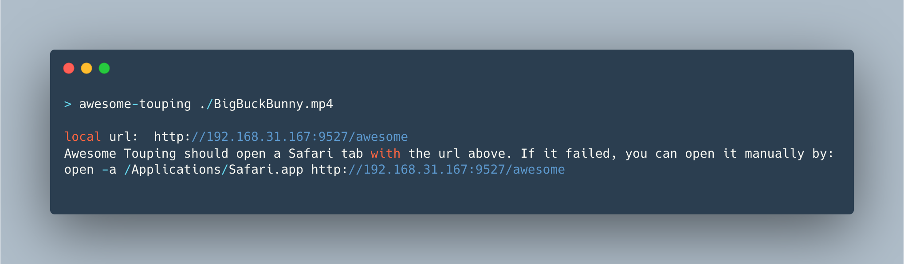
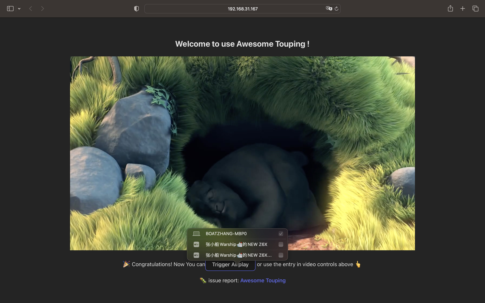

# Awesome Touping
Boost the joy of your local video to smart TV through AirPlay!


Pick your local video, served as static resource with [Content-Range](https://developer.mozilla.org/en-US/docs/Web/HTTP/Headers/Content-Range) supported, and open Safari automatically.


And after that, you can choose the `Airplay` button in video controls, to share video among all devices in your local network!

## Usage

npm 
```shell
> npm install -g awesome-touping
```

or homebrew
```shell
> wget https://raw.githubusercontent.com/AndyBoat/awesome-touping/main/awesome-touping.rb
> brew install ./awesome-touping.rb
```

```shell
> awesome-touping -h

awesome-touping <path>

serve local video file with an accessible url in local area network on MacOS. **
Mp4 only now.**

Positionals:
  path  the path of local video file                                    [string]

Options:
  -h, --help     Show help                                             [boolean]
      --version  Show version number                                   [boolean]
  -p, --port     Local port to serve from               [number] [default: 9527]

```

Example
```shell
# Serve the example.mp4
>  awesome-touping example.mp4               

# Same as before, serve the example.mp4, but with an explicit command `serve`
> awesome-touping serve example.mp4        

# Serve mp4 in an given port 3000, instead of default port 9527
> awesome-touping serve example.mp4 -p 3000  
```

## Guidance

### You are not using Safari
If you are using Chrome or other AirPlay-unavailable browser, you will see this above the video:


Please copy the url and open it in Safari.

### No Airplay Device Detected
If awesome-touping doesn't find any  "AirPlay-able" device, you will see this beneath the video:


Please check your device is working as expected, and is connected with a same network as your mac, which means both are in a same WiFi for most cases.

## RoadMap
- Support custom port and local ip address;
  - [x] custom port
- Publish as homebrew package **[WIP]**
  - [x] usable local rb file
- Support interactive command-line;
- Support proxy for multiple video, with custom order;
- Wrap an application on MacOS;
