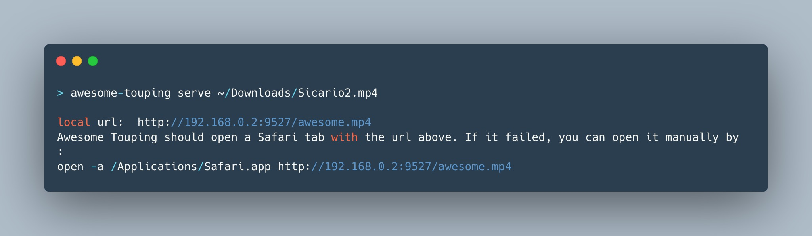
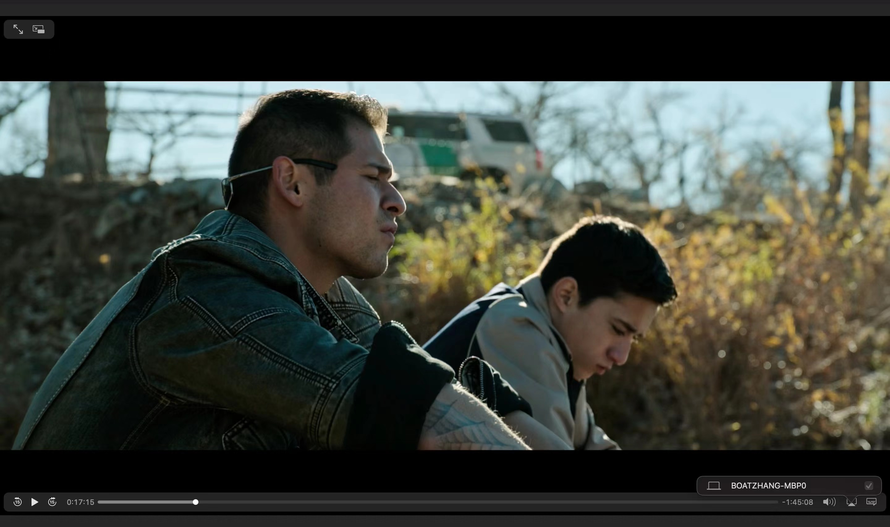

# Awesome Touping
Boost the happiness of your local video to smart TV through AirPlay!


Pick your local video, served as http static resource with content-range supported, and open Safari automatically.


And after that, you can choose the `Airplay` button in video controls, to share video among all devices in your local network!

## Usage

```shell
> npm install -g awesome-touping
> awesome-touping -h
awesome-touping <command>

Commands:
  awesome-touping serve <path>  serve local video file with an accessible url in
                                 local area network on MacOS. Mp4 only now.

Options:
  -h, --help     Show help                                             [boolean]
      --version  Show version number                                   [boolean]
  -p, --port     Local port to serve from               [number] [default: 9527]

Examples:
  awesome-touping serve example.mp4         Serve the example.mp4
  awesome-touping serve example.mp4 -p 300  Serve the example.mp4 from local por
  0                                         t 3000
```


## RoadMap
- Support custom port and local ip address;
  - [x] custom port
- Support interactive command-line;
- Support proxy for multiple video, with custom order;
- Wrap an application on MacOS;